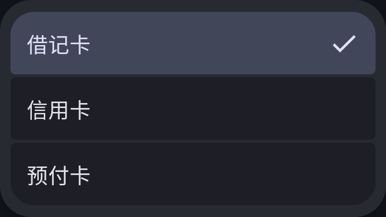
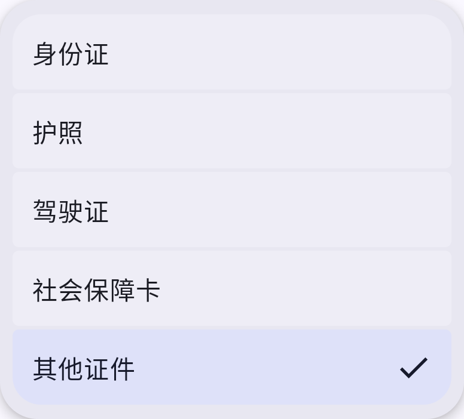

# 表单选择菜单 · 1.0.316

[打开本地 M3E Canvas 草图](http://127.0.0.1:5186/#docz=vZRdSxtBFIb_isz1FmK6WsmtUFqKt94UkdnZSTJksrPsTkJSCYhIQTRoqxa_aEmRailYS60SP6F_pRmzufIv9MxusklqjdiLEsjueefMzPOeMzszSDLJKUqhCeEwgod-ngwFtX1VXW_NLlwvfg6Wd-AdGSjt4bxOc7PCoRC7HMu08PIgYcf2BLO1iDmVkr6gZZAlxRw0maV64gyysZdDKekVqIEsIbMTwqZ-R_Cz2NXLe6Lg2FSvlReSCQckWnI96vusSFGlzQHTXs4g2DKFSFYwAoKBnAiwtXoc1JZUtaatwKP57Uy9X4TxEkolDFQO_x0hdW7kLjg6Cq7etF2vbTXn6jfn20nTdtXuO7XzOth7e3O-BOVo1ermmO0GP050_GWjcXqgLlbVQhUGVP1Y7eyr5e-Ny73rjcvm7qn6WlfLkLmtVuajyWr7VB1sqZNPkNZc32xuXvyanUOVKQNlwLbbYyrzKOpKCD2cDKnNMQPhEoMsEA3EJM33zOjk55gThrQkIeLYory3JqD57BVYT5qwBNH1dQqcG6iIPYYdCblpxjk0oDJVMWIaCzu5PpjhkcQgmnZ-D8xTRrl9m2il2tw7jKEej45Gr0mUGhn9C1SHGWFC4KDIaQtz7BDaTyvLbn_pkonBtYvy27Q-5ZT0Fq_3DD2Uk3jUZnKaYE-LElvRtvHSsx-Cg0PdF43fURtXteba_p9q6-N842wjVOHERJSwVSrR550Ui33WR4YHNipKH9Cn8cnJf7DNBcn190S4-mv2-9vyxIzZyjCSwS6ItxhtajHZpeTMl88ho7dDcRnvQtWAYW-BD-6h8rhwJGYO9drMyfAmoSSH7vksDESEB_N8faNJrs8W9NWLnlY7tsK4EtuPTsFAC92e32eh4KUxobGBZyyTfTC0GTGbEbIZEZtdYLhwXRze6HcTd8_j_yAeVOYp-P0G)

银行卡卡类型、证件类型复用 MonicaExposedChoiceMenu：24dp 外圆角，选项边缘18dp、相邻4dp；统一48dp最小触控高度、固定左右留白、选中底色和右侧对号。沿用原来的枚举值与保存回调，不修改数据格式。

普通版和 F-Droid 均已打包；FormChoiceMenuTest 两项设备测试验证深色选择回填、关闭/重开状态、130%字体和返回取消。截图来自公共 API 32 模拟器中的实际 Compose 组件，非完整编辑页截图。

