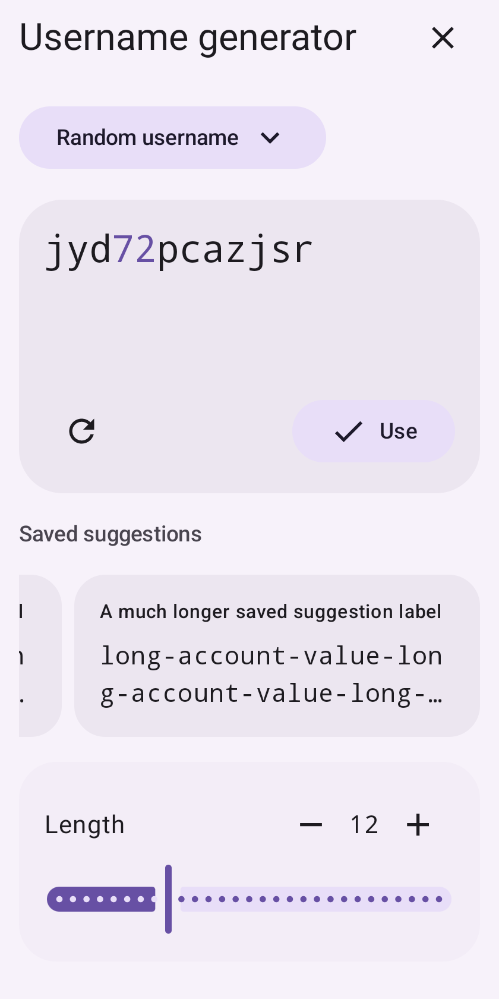
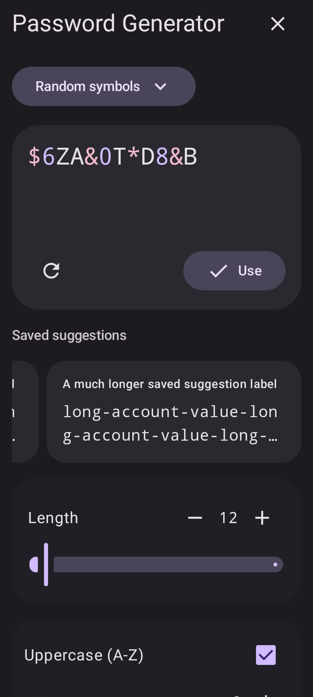

# 生成器常用建议 · 1.0.316

[打开本地 M3E Canvas 草图](http://127.0.0.1:5186/#docz=tVNPbxJBFP8qdc7bBChW3G_gwZNHw2FgB9h02CWzsw1KSGhjpFWsmFJFmkgltSUaVg8m8rdN_CiW2YVTv4JvdkWBA6kmXnbnvXnv936_994UENc5JUhFXq3p7lXF2_ba929rXmd_-qkuul2v1haD_sRxkIJyFPOUybIQjA2NmboGTp4hWUgvIA2zLaSmMLWIghImz9w3NWIhlTObFBWUYjgrzYcFBHkqsux0mlhcNw0LUAwsQdB8QUlDHPeF05i2nkzO9ybvK-7RF4jNIzWkoEf-1zC5n1etjLsl0XkzHh1OnAtv5Iy7z71BE5xSRv_setiAs4Q4KU9b9avSzrh7Ks36gfu6HBS4Ku267Y-i-sodNMSz9rj7wq31xMu6cHrQlRnOsTg9Dwq5lX1AkP5qxe18EK13cL4eVrzdnigPxqNLKcUB0l_FQVOUhoCPinEFpZlp5-Y6EQzA1xXe9IWFQyAN53UIAq-CdE6yywnr0gl3W7rh-0ieg0VxgtClRkqApGkg1bApVdA2Zjo2OASldEqJnKGlP4YuhmPFeFGZjSdjMr5IKrqSlJ-wRCqJmTZHSrbZubgBHTuXAzDdSIP3Ac7mKLkVjfzheScaHCOyUzG5BPeyOE2CVVNQ0mQGYZbcSQ5lI0Cbs-Cf-GUnfLs4p5eaUC2Qezd2E70yYbVc8fmpd7Ij-ofBMP5St49P8r769W1MbfKjdPafe0CMNM8sDD0i66xogp-xehWnR5fwcORrjkT_bRWprhG2QGsjvHoX_YwlWr9hZsRuSmbj9qa8hQkgNRoCYvHiTw)

建议卡片与横向列表统一高度，预留一行标题和两行明文。高度根据字体行高与固定内边距计算；系统大字体同步增高，滚动期间不随可见条目重新伸缩。超长预览省略，点击应用完整原值。

普通版和 F-Droid 均完成打包，各通过3项 API 32 模拟器测试：用户名短/长建议切换、密码双倍字体下等高和完整值应用、原有生成滑块拖动行为。检查列表高度和下方滑块位置前后相等。

