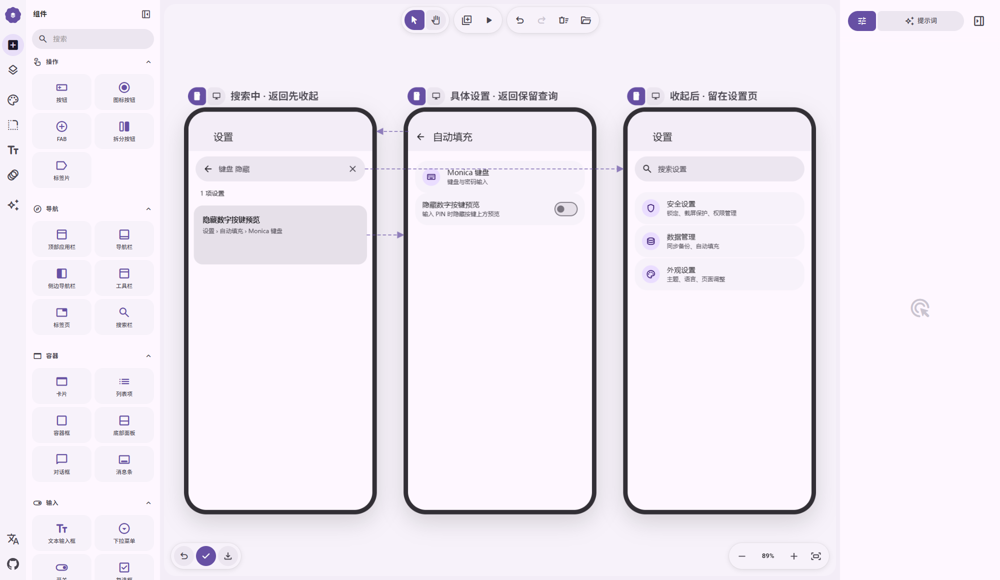

# 设置搜索返回行为

[在 M3E Canvas 编辑](https://lnkiai.github.io/m3e-canvas/#docz=1VhbTyJJFH73VxCe3YRGVJy33Tezmc2-byabAgrp2HaT7mZGd2KCFxx1RNmIt1HHxeBlZxRnVkcRFJP9KTtd3c3T_IWt6mqEhgakYR_2hVCnqk7V-c73narq130ul1tmZQ66n7nczwWeDQLX3zcu_SGNdt-r6Wv9y42eK2n3OTW1p10duvvJhIDIwjCZQI1qZkFfvUGlLW3-WJu9VRc31b0l9eBIvzhUt67V7ZKWLVCHWu4cZa--3e3iYehNkTa1j29R8lLNJ7Q_C3TW1_gMbpZ3stQhur0uv0vpW2vldE7b3f4an9Uui1rxgPpEe6fUTneLUqvK3TZKLGrFdXX_gO7w292KtrGDR9JYypkv2IlSXCVj3u_pF8fqXIJ6U4pJ5WEfD67sZJaGHBbBhIFRNCLwkNqiHJDDgjhBzIAPiQIbMjsAB2UZ_ginjBkxMcqZU-QINNy8xg3cDAFxHLfCgJNgPzUFBDnyXAhBCdtlMVYxSxEQNdYXhRgfgnQhsi-Bl4lZmpJkOFGxTggyK_DEDiejIpQk9iV0467paizE_y_GaLoXbMfbf2b2fucxXWEzb0ZOoVTy51WCYJgp6tXRk3io57E1ZWkFxoytxsQwCMKaBQTZWKA2q4REFXKhm2OldELJoj_sosSRdnam5JfQ5zVMJZp8tHaBN4PWk6iQrvVDEmisM93fPFimMViUuFHu1yldqvHWUsMasm_E6yxoSj7MSFMhJLK4EdlK7WpobZmSldjzSf3kGK39ju7iKHH5pBC9Nvms6IXEVycPa3Ajfp-z4OjelXwBS1vJp9W_MrgyUFHjONSZQ5RNqukSyp6UN_aU_CrKragbV3QXOLVoIameZUzoC1kt_RmtHuDdlffxxHkttVANHf--MMg9hgUSbUruAAiO13K7FVvBJEv8YOujicUaq_qu9d98DaNnnOWNPlmIfh-N_gBEazcHApAz2GCEbu1kg4aU-RjHWewvgcgCqv4wy3G4Jjz2Tpv_XrTghbFNxgoFM2TBgvH0CA3GHg0JAjEYaY4GlbaLFn9bUNxAFIVXv5JF3G3AaZjuJZ1BTpCgtQ8ESfGUHqt0_ZpWKynqgp3Oqt0i4CW2UpDDIATdliHTfXb_n5xCrzWFXqtUmWFfb1LobUJoOCk3yR7jKmduuyO0pVtifyNFhfF1jtFAHc2ttdrL9IjmA_YYBYEYasZwg9rqxid0vqWuLGHClw_n9ZNFe7LLMR52RHMpFo0KoszyY9Xi4vonXnDpbz6g5VOU-YgSCcNgXv2o4qxOeGF0AoxBy33EmpIBv7_BTNTFDHhtlNUorFoBMXUCqpOPxLFW_ThQjO-pR3dXZPA5PAFqMtPTktdVWfO0K2sNeem6rg1aszTo8VsLW69EO2ifJ46V5NHqlbo-TS30UsnTOJwKCA3S70ix1D25GF0saH_M6KV1fPl1cMwPtcHS7-0NlkOOsOyoCHZ8alhLoIGg6-fRn1z4aWoubCyp5JfVzVu7haVXrByM2JW_YAQGx2Go8oLrPC_DT71nd5WV4f_HXdRfd0h7PJ7_5jbqd3Ybpe_RFqiYHtw9R2akHTL-HiEz4ki_KLeEEqctgYmwkOuuEM6g3DvyXWjxA34c45exupwlzf258k5Ky2XwY9DJ88fTBlnvYI-uz4zHEbS4KKrJnBmfLbQhIIMAkLq5F6LUinp-hLJvlOI9xtRyA3GAKdMG0wGvv0eYMs7omt3UT2Zb0dX8ftcFpEq-WD7cJmBenOuncfyHfrbQP82pG1dNUSVfMfqm_wU)

搜索框获得焦点或有查询时显示返回箭头；点击箭头立即清空查询、清除焦点并隐藏键盘。系统返回在键盘收起后优先结束搜索，留在设置页。从结果详情返回仍保留查询。

## 交互与实现

- 有查询或输入框获得焦点时，左侧放大镜变为返回箭头；点击后清空查询、移除焦点并隐藏键盘，恢复普通设置列表。
- Android 返回键 / 手势通过 `BackHandler` 优先关闭搜索。软键盘可先消费一次系统返回；搜索框箭头可以一次收起键盘和搜索。
- 已聚焦但未输入，以及仅有空格的查询，同样能够收起。
- 从结果卡片进入具体设置后，返回仍恢复原查询和结果；收起搜索后，再次返回交给原页面导航。
- 顶栏返回与搜索框箭头使用相同的收起动作。真实设置标签页没有独立顶栏，仍可使用搜索箭头和系统返回。

## 验证

2026-09-28，两版 Debug 构建与各 16 项设备回归全部通过。其中搜索 9 项，验证从详情返回保留查询、原设置定位、无匹配结果、深色窄屏 / 1.5 倍字体，以及本次增加的返回收起、空输入和空格、后续返回交给父页面。普通版逐项核对 92 个具体设置目标，F-Droid 91 个。

新增返回测试使用 Android `OnBackPressedDispatcher`，断言输入内容为空、焦点移除、结果隐藏及导航未提前返回；未用占位提示文本代替输入内容判断。设备为复用的 Android 32 / x86_64 公共 AVD。

[普通版记录](main-validation.json)、[F-Droid 记录](fdroid-validation.json)与对应设备日志附在本目录。两版改动已同步，发行说明保留旧条目并增加本次行为。

