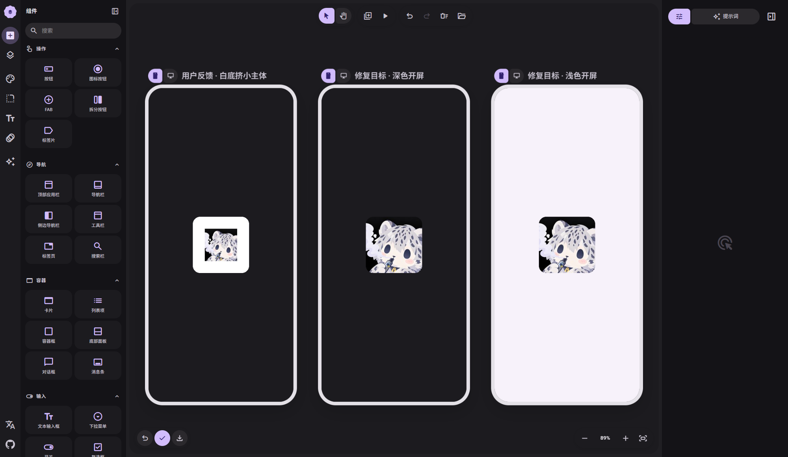
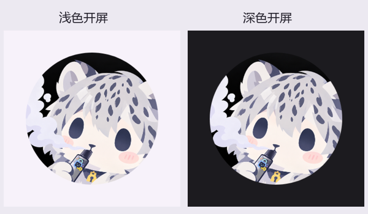

# 雪豹开屏白边修复

本次只修改 main 与 F-Droid 的雪豹图标资源。实验性功能保持暂停。

## 问题与处理

用户截图中，雪豹图片被缩在很大的白色圆角底板中央。原始 PNG 没有白边；日夜启动主题也已将 `windowSplashScreenIconBackgroundColor` 设为透明。

此前 `ic_launcher_snow_leopard.xml` 使用旧式 `layer-list` 位图，而 `ic_launcher_snow_leopard_round.xml` 和 Grok bot 均为自适应图标。使用普通 `android:icon` 的系统可能给旧式图标追加兼容底板和缩放，主题的透明背景不能可靠地消除这层包装。

将普通雪豹图标也改为 `adaptive-icon`，复用已有黑色背景和前景资源，让系统直接识别背景、前景和蒙版。普通与圆形入口使用相同构图，避免额外的白底与缩小。

- 保留原始 512 × 512 PNG，SHA-256：`e373bbe74765f68608838ed8ff37cccea7ee1a8f685b0f2074943d04b1e53ea0`。
- 保留前景的 `16.6667%` inset、过滤和 mipmap；没有再次裁剪、重绘或放大原图。
- 系统仍决定外轮廓和开屏尺寸；圆形蒙版会遮住图片四角，主体位置与既有圆形图标一致。
- 保留默认 / Grok bot 的选择、语言切换、桌面名称与升级修复逻辑，不增加启动等待时间。
- 同步中英文发行说明及 F-Droid 21 版说明，保留“彩蛋娱乐性语言，只保留一个版本”。

## 可编辑设计

`canvas.json` 可在 [M3E Canvas](https://lnkiai.github.io/m3e-canvas/) 打开项目；[完整分享链接](canvas-url.txt) 包含相同设计。

草图在修改资源前已通过真实 M3E Canvas 导入和渲染检查，结果见 `canvas-check.json`。草图采用用户截图的圆角外形，设备实际截图以系统蒙版为准。

## 验证

2026-09-28：普通版与 F-Droid 均完成 Debug 应用及测试包构建，各 16 项设备测试通过（图标 7 项、设置搜索 9 项）。复用公共 Android 32 / x86_64 AVD，未清除用户数据、创建新虚拟机或改动实验目录。

- 检查两版共 6 个 ABI APK：普通与圆形雪豹资源均为自适应图标，包内图片像素与原图完全相同，见 `resource-check.json`。
- 图标回归涵盖雪豹语言切换、中文回退、唯一桌面入口、Grok bot 优先级、桌面名称、升级修复、设置保存及深色大字体。
- 真实开屏来自 Pixel Launcher 点击雪豹图标，不使用草图替代。分别检查两版浅色与深色启动窗口，无白色包装边；原生圆形蒙版内的耳朵、面部和手持物保持既有构图。
- 截图时临时启用雪豹入口，结束后恢复原有入口状态与系统日夜设置。验证范围为系统开屏及所列回归，不覆盖用户手机的厂商系统，也不代表完整解锁流程测试。
- `main-validation.json` / `fdroid-validation.json` 记录安装包哈希与设备校验；各截图旁的 JSON 记录点击方式、时刻及相同安装包哈希。

[普通版完整浅色截图](device/main-light.png)、[深色截图](device/main-dark.png)、[桌面图标渲染](device/main-launcher.png)；[F-Droid 浅色](device/fdroid-light.png)、[深色](device/fdroid-dark.png)。对比图只截取真实开屏中央区域，未修改图标内容。
