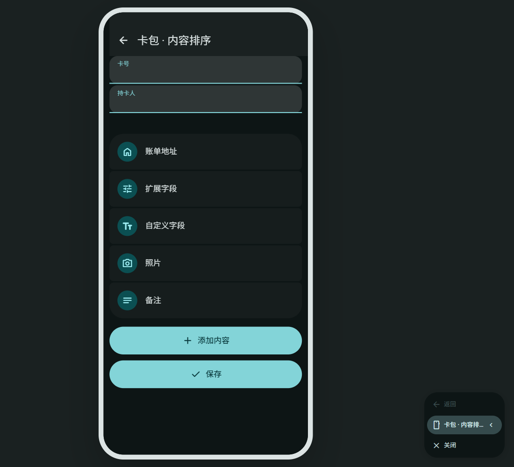

# 卡包内容编辑 · 1.0.318

银行卡与证件的基础资料继续直接编辑；添加的内容统一放在紧凑卡片组中，点击进入独立编辑窗口。

- 长按内容卡片拖动排序，也可以从右侧菜单上移或下移；提供对应的无障碍操作。
- 卡片左右留白 12dp，组内间距 2dp，默认最小高度 80dp。大字体允许文字自然增高，避免截断。
- 扩展字段、账单地址和自定义字段使用相连的填充式输入。编辑窗口可滚动，并为输入法和系统导航区域留出空间。
- 自定义字段内部可以上下移动、切换敏感属性和确认删除；摘要卡不展示 PIN 或自定义字段值。
- 排序随条目保存。旧条目没有排序字段时使用默认顺序；未知区块标识不会隐藏有效内容。Bitwarden 下载保留本机顺序，未增加跨设备布局同步协议。

排序范围是账单地址、扩展字段、自定义字段、照片、附件、备注等内容区块；内置字段仍按表单的固定顺序排列。

## 本地 M3E Canvas

[打开可编辑草图](http://127.0.0.1:5186/#docz=vZftT9NAGMD_lWWf1ZStjs1PQowJMRg_-M0Qcltv7kLXW9obgoQETHiTVw2IIZAAEkETJkQIAgYT_xSzW8d_4V27l557ueKqyZa2z_V5-us9rx0LE0R0GL4XCvdjA6VA6OdZiC7u0IUpOj1FC-fFb0ulpbf0Yjl8KxROmyDr3JvLYANySU4HJI3NLBcCQzMx0hwx0CEh8BEc5QsEAp1LSQY66mNhDZhD7ISYecjkSUwy_ViDFhOlgW7B8eqzuOTZWJgZZWZSwNQsbseoULicDrHDWgcdYcsKO_LHK8xa1QQcISbwmijNfaLHa_RwvVQ45Ybs7-_KV2-qJtR4MyOpvEVw1mulPPOZFjaK53OtDCVidUMD7Oy5ifO5xpdLArOq0RWpKrAjGEH8ZnbNLhCB2aaqCl8dBiYCBuHyNNJ16LgDpbDheMg08YvBJEgNcekQMhx9gnM9uVyv-2wdJKHeZnPHB_7cTg-0mvBPXdUNlrqFPwVq138e7ET3DTa7qhwsd-sIEtCTwBhqiJB4XErN9aTARl7XvaDMQw8R1LWGsFg-c03peSf6f03s1n6h1hddkajK9Sz0kqtF4_E_XqwrEMDSwiRjLF5cCIz23kXxal5Y83AI0YENAg1iNWxzRL0rj46Ksjw4MjgLvWGhI4v0MXNiVJx8pItrdPOIbk2IyOzCBBrKW09xzmGrCXox4dWJJWOTl5JucZjkDTmXN8vacvnEisixmK8H09zZlnzXxFwKAjAqBWQdkeDBFGsIboNpS2hP7dtzM0GAqVIwAxMo3zO6N1P6enBToogqpA7QtIasiUVVadYwPR_V1DVefYtknjEYYlSeXdLX2263apPgFhiGDZjdSkSKyRXlnKkMFAt-E9Lijy16-L4NYz3SxbaaiEkpXdVgin359Izuz5c2Z4VaqnR1VItcwGCKvQtIz08EwIgSiXWSXC6htCj5InzS97hls-ycUVqX_PX02enyzkLx8oO9PSl6WmFNu3NKaZHyR1nYLW0u2qun5S9bAqWqKLcV9690WMGy2ISNWadG5cWBawZYxJp0LgFUq3x_iaCxhHwU5JrBVDFaWCjNrrQbpZxZueZJcdT2Uco8-gENr8620pVFe_9ICCHW_uzVg-tXBbtw3NmgVUcOpsJVkGtNrYYMR0A2p8P7leMdZLAl9-v7r4eKOrx8IhtGFkoiHZHRQZxOSweM642V8vpys-Z84yR1MXtSBGHDagysaNTvV1zFxH9MW_e5DzzJW-f2k7x1_X-awgPjvwE)。如编辑器未运行，在工作区执行 `.tools/start-m3e-canvas.ps1`。

离线源文件：[canvas.json](canvas.json)。草图包括内容卡片、扩展字段和敏感自定义字段三页。

## 原生界面与验证

实际设备截图和最终验证记录见 [验证报告](../../verification/wallet-content-318/README.md)。截图只包含合成测试数据。
