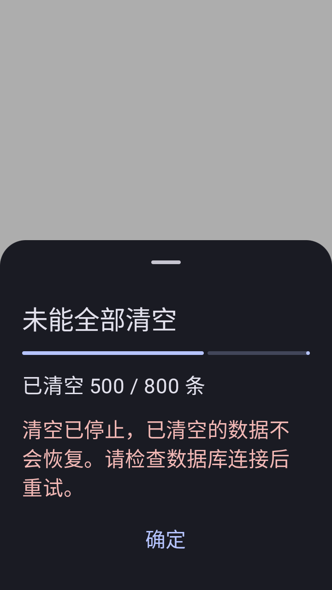

# 清空数据性能与进度验证 — 2026-10-07

设置页两处“清空数据”入口已接入同一后台批量流程。按原有活动条目范围读取快照，每批最多 500 条，按 MDBX 数据库分组，通过现有 repository 删除和失败回滚接口执行；每批成功后才累计完成数量。主密码验证仍保留，执行状态由 Activity 的 ViewModel 持有。

## 性能实测

公共 AVD：Monica_Issue136_API_32，Android 32 / x86_64。独立磁盘 Room 数据库，3,000 条合成密码，每条含 256 字符备注，同时运行一个完整密码列表 Flow 订阅。计时从读取快照开始，到删除完成结束，排除建库、造数和 UI 动画。

| 路径 | 时间 |
| --- | ---: |
| 修改前普通版：原设置页逐条 repository 删除 | 340,623 ms |
| 修改后普通版：ClearDataUseCase | 553 ms |
| 修改后 F-Droid：ClearDataUseCase | 530 ms |

这是该虚拟机和合成数据的测量值。真实设备、内容大小、外部库的加密参数及网络保存耗时会影响结果；不将本地耗时推广到所有远程数据库。MDBX 另外验证了真实 Sky 数据库删除后重新打开的持久化结果，未对远程网络耗时作保证。

## 验证结果

普通版与 F-Droid 各 16 个相关测试通过，共 32 个；每版另在 360 × 640dp 小屏重跑 4 个 UI 测试，全部通过。

- 3 项 JVM 状态测试：防重复触发、失败保留提交计数并允许明确重试、空选择不执行。
- 1 项磁盘性能测试：清空 3,000 条后查询为空，完成计数为 3,000，进度单调。
- 5 项设备业务测试：逐项检查六种选择；验证关联自定义字段级联删除及未选择类型保留；归档、回收站、不可用 Glitter 库维持原有边界；模拟第二批 MDBX 保存失败，保留剩余 150 条且只报告前一批 500 条；主线程调用时准备与历史清理实际在后台执行；真实 MDBX 清空 12 条密码后重开仍为删除状态，未勾选笔记保留。
- 4 项 UI 测试：返回键不能隐藏执行面板，数量及完成状态正确；深色 1.7 倍字体失败提示与操作可达；验证期间禁止重复确认和更改选择；Activity 重建保持同一任务与计数。
- 3 项已有设置回归：主密码输入和类型选择门槛、全不选时禁止提交、搜索只定位清空入口而不触发删除。

两版 `assembleDebug` 打包任务通过，包含 x86_64 测试 ABI；测试 APK 打包通过。设备测试使用 ADB 安装和 AndroidJUnitRunner，避开工程现有 connectedDebugAndroidTest 对分包列表的识别问题。首次新 UI 测试的两项失败来自测试仅设置 Context 语言，未设置 Compose LocalResources；补齐测试语言环境后，两版正常尺寸及小屏复测全部通过。应用代码未因此绕过验证或更改语言行为。

## 删除边界与失败处理

- 保留原有六项选择，不扩展为删除所有数据库文件、归档、回收站、Passkey 或其他未选择类型。
- 不绕过 repository 对 MDBX 的检查、保存和回滚；不改变 KeePass / Bitwarden 既有清空语义。
- 生成历史单独显示清理阶段，不伪装成密码条目数量。
- 失败不显示全部完成；保留之前成功批次的数量。进程被系统终止后的自动续跑不在本次实现范围内，旋转和 Activity 重建已验证。
- 未改数据库表结构或设置模型，无升级迁移。测试仅使用独立合成数据库与临时 MDBX 文件。

## 界面记录

[打开本地 M3E Canvas 草图](http://127.0.0.1:5186/#docz=xZbva9tGGMf_FfO8FkySFdvVu_VdGYXB9m4L4xJdbBFZJ07nNVkI2E3zC-oQCKWjy9q1jbdsELsrYw5Z08L-lViy_F9sJ8mWojSyZJr2lW35-Uqfu3vuo1sDpjMDgwp3iakvosK__YJ7ujn8_cx99Mptd713Pzlnv4IASxTVeZlVIyYGASwDsSVC66ACMjVKdI1fRAZmDH-BV3llg1oGL2U1zKNroCG6DOoSMmwswAJhtbtEw3Z4ZT18hg3qN2uga6AGv0UQwAye7e7-5j1_ODg9AQFWQBUFWAVVXBfi5VJU7vRfO92H7s5-UK6U3huQo8Bo49jZ2XKO_vT-6gSZW_I4My9AlZKGFcOrYaRhKgaVkuwX8nq0otugwioIoDNcv5rgke8R1ZHJOIVuGJjPnr5ITD6dlJJ73y2gxWUQwEAL2Pg_6XXfDs-7IMCybvI7MWJ9blm3EYX1-cl4bMyYblbty0gS_7yeaRJKp7IZoaiKY0jO0fbgn_PB6V7QKRGbodvsDsN1EMBuWBah_P480HvjbHYumq0oGes0Xq3_gEEtViqxMWk6MkhVjK94SaqkDShMpA7HbBhGNJIIfYEwRupf1TBmEx6Fzx__KoMqlxUBKNL0hv01sUCVK-Oft_0kvxKD9_dWyC4rAbxSSoMPEjnY3ZOXzuFxYiLHTYJXomHISrxTGLYSXLdSJ9UPzIjl9LaGv7SuwZJKMSyLkirFtn0ZrawU09AmoZlW3NBNjOiX4T2iJpRK_GZGgzeAGENcJA2TJfjKqZs-SOSAc_qvg4krSIIsioXPCkVBFMWC-_Pz6yYxvrb3kJ4ArMipPecHcvB5vf7wZNd5u-ketAfnhxPHTiUL9CeFOi5nN6Z008ZMMGVU5hSsT6tM6fJbL5M00wf0MaU5pq9kt2Ye-FBMaZ17xZdJpOnCzEPEDytHD4b7W-5uc9TcTVX5e52ZwMsozdlWPIM0JfGKNZOEGbSZcwZDbebSpUbMcbeVw9NeZcpe4YkcYMNnnVHrYHC2FdsyDcaIGe0W8Yol5fAAWsxuSfmmLZlgymjJKVif1pLy5XP-XDnVM2HmRizpb56clhzTK6GSRGWqJfPAu4d_eBvnzubxaCM8ymV1ZRJsLnVa_UR-e_vHSvfx36PWtrPzavS4O3rxYx5jJiDLopTFmLOt_kzHzCSgnKqlIPLxzpmYUkKTiOW5NMQgMgvi8MmDYDcPTtuDN0_c1gvnqH3RvP-t6fX67sum-6wT_O-cHXjvnrp7HWd_b7Td9nqPLpr3rxtOMfEeCEcjSZXwRaCktoQf-fAvgvn1_wA) · [可编辑 JSON](../design/clear-data-progress-317/canvas.json)

普通版修改记录到 1.0.317，F-Droid 记录到独立的下一版未发布说明；本次没有改写已发布的 24.txt。公共 AVD 的显示配置已恢复，已停止本次启动的模拟器，保留配置和数据盘。没有额外交付 APK。

原始构建、设备测试日志及测量结果保存在工作区 `.codex-tasks/clear-data-progress-20261007/`。
