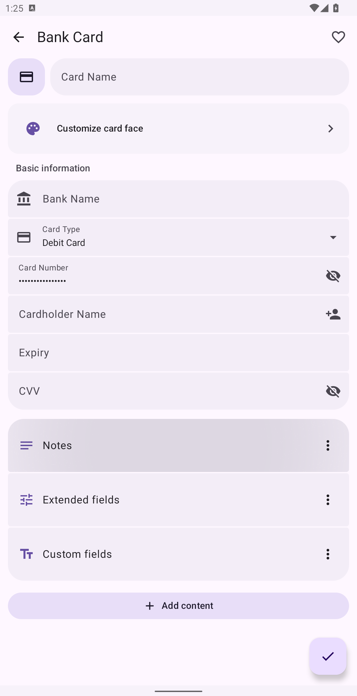
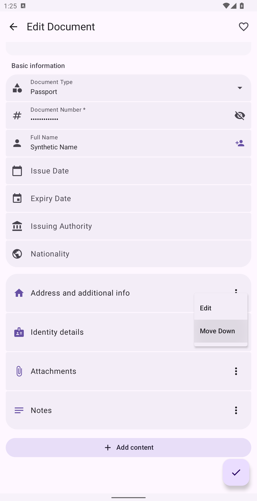
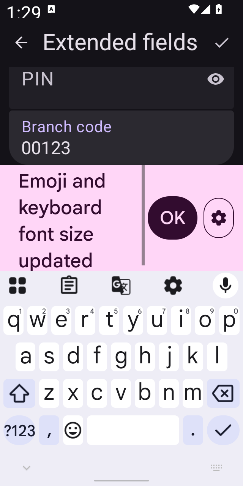
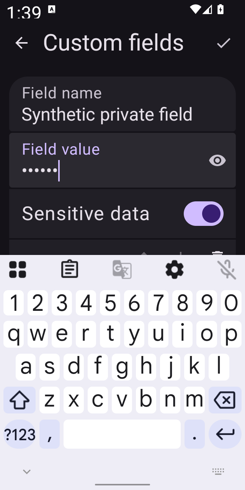

# 卡包内容编辑验证 · 1.0.318

2026-10-07，普通版与 F-Droid。使用公共 AVD `Monica_Issue136_API_32`（Android 32 / x86_64），在测试用户 10 中运行，数据均为合成夹具。

## 结果

| 检查 | 普通版 | F-Droid |
| --- | --- | --- |
| Debug 应用及设备测试包构建 | 通过 | 通过 |
| 排序兼容、银行卡／证件 JSON 编解码 | 13 项通过 | 13 项通过 |
| 编辑器、字段建议和 MDBX 保存回归 | 12 项已覆盖并通过，见下述重跑记录 | 12 项通过 |
| 真正 320×640dp、1.7 倍字体、深色与输入法 | 1 项通过 | 1 项通过 |
| 两版修改文件一致性、diff 空白检查 | 通过 | 通过 |

设备回归覆盖：新银行卡添加备注、PIN 与隐藏字段，长按真实拖动，卡片尺寸比较，保存和重开后的顺序／敏感值；既有证件菜单排序与 Activity 重建；旧扩展字段、输入建议、密码编辑保存；MDBX 实际文件保存并重开。小屏测试等待编辑窗口的输入法可见，再检查当前输入框与顶部完成按钮均可达；关闭再打开编辑窗口后，尚未填写的已添加字段仍在。

普通版回归批次最初为 11/12：测试在输入法收起时点击“添加内容”，未打开预期选项。给测试补充输入法等待后，包含该用例的三个钱包编辑测试全部通过。早期视口外位置比较也已改为先滚动到完整可见位置。一次误重叠的设备运行已取消，不计入通过结果。后续设备批次均串行运行。

结构化结果与 APK 哈希见 [results.json](results.json)。完整构建、失败及复测日志留在工作区 `.codex-tasks/wallet-content-318/`。构建仍有项目原有的废弃 API 等警告。

## 实际界面

以下截图均来自原生应用。小屏截图里的粉色字体提示属于 Gboard；即使该提示和键盘同时出现，当前输入与完成按钮仍然可见。

## 范围

- 排序对象为内容区块；内置扩展字段按固定表单顺序显示，自定义字段内部提供上下移动。
- 旧条目通过默认空列表兼容，无 Room 数据库版本迁移。
- Bitwarden 下载保留已有本机布局顺序，已检查映射；本次未进行真实 Bitwarden 服务端及 KeePass 端到端同步测试，不声明跨设备同步布局。
- 本次验证为 Debug 与 API 32 虚拟机，未运行其他 Android 版本或 Release/R8 测试。
- 发行说明同步到普通版、F-Droid 和候选的 1.0.318 未发布说明；F-Droid `24.txt` 保持不变。

[本地 M3E Canvas 设计与交互说明](../../design/wallet-content-318/README.md)
